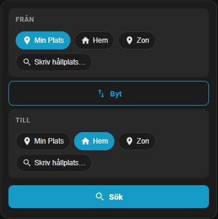
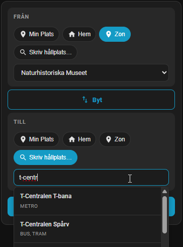
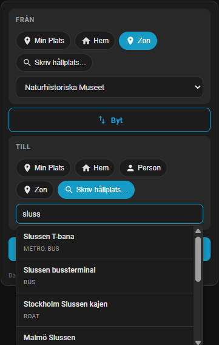
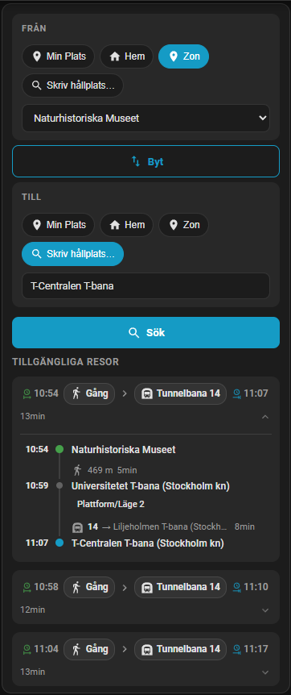

# Trafiklab Dynamic Travel Search Card

A Home Assistant Lovelace card for **on-the-fly** public transport journey searches using the [Trafiklab integration](https://github.com/MrSjodin/HomeAssistant_Trafiklab_Integration)'s `travel_search` service.



All [screenshots below](#Screenshots)

## Features
- **My Location → Home** quick-search buttons
- **My Location → Person** quick-search (shows a button for each `person.*` entity defined in HA, toggleable via `show_persons`)
- **My Location → Zone** quick-search (shows a button for each `zone.*` entity defined in HA, toggleable via `show_zones`)
- **Free-text origin and destination** with live stop autocomplete (uses `trafiklab.stop_lookup` service)
- **Swap** button to reverse origin ↔ destination
- Results show trips: start/end endpoint pills, transport-mode pills with line numbers, optional 3-line per-leg details
- English and Swedish translations

## Requirements
- Home Assistant 2023.7+ (service response support)
- [Trafiklab Integration](https://github.com/MrSjodin/HomeAssistant_Trafiklab_Integration) with at least one Resrobot travel search config entry

## Installation

### HACS (recommended)
1. Add this repository as a custom repository in HACS (Frontend).
2. Install "Trafiklab Dynamic Travel Search Card".
3. Reload resources when prompted.

Note: The card is to be included as default in HACS, however the HACS team has some backlog before this card can be included. They work as hard as they can! 😅

### Manual
1. Build or download `trafiklab-dynamic-travel-card.js` from the latest GitHub release.
2. Copy it to `config/www/trafiklab-dynamic-travel-card/` on your HA instance.
3. Add a Lovelace resource:
   - URL: `/local/trafiklab-dynamic-travel-card/trafiklab-dynamic-travel-card.js`
   - Type: `module`
4. Refresh your browser cache.

## Add the card

### UI (Visual editor)
- Dashboards → Edit Dashboard → Add Card → search for **"Trafiklab Dynamic"**.
- Configure options in the CONFIG tab.

### YAML example
```yaml
type: custom:trafiklab-dynamic-travel-card
title: Find a route
# config_entry_id resolves the Resrobot API key automatically (leave blank for auto-detection):
config_entry_id: <your_trafiklab_config_entry_id>
# Optional: person or device_tracker entity for My Location (leave blank for auto-detection):
my_location_entity: person.jane
# Zone entity for the Home button (default: zone.home):
home_zone: zone.home
# Show all HA-defined person entities as quick destination buttons (default: true):
show_persons: true
# Show all HA-defined zone entities as quick origin/destination buttons (default: true):
show_zones: true
max_items: 3
max_legs: 12
max_walking_distance: 1000
include_platform: false
```

## Configuration options
| Option | Default | Description |
|---|---|---|
| `config_entry_id` | — | Config entry ID of a Resrobot travel sensor (resolves the API key). Leave blank for auto-detection. |
| `api_key` | — | Direct Resrobot API key (alternative to `config_entry_id`) |
| `my_location_entity` | — | `person.*` or `device_tracker.*` entity for the **My Location** button. Leave blank to auto-detect the current HA user's person entity. |
| `home_zone` | `zone.home` | Zone entity for the **Home** quick-destination button |
| `show_persons` | `true` | Show all HA-defined `person.*` entities as quick-destination buttons |
| `show_zones` | `true` | Show all HA-defined `zone.*` entities as quick origin/destination buttons |
| `max_items` | `3` | Maximum number of trips to display |
| `max_legs` | `12` | Maximum number of legs rendered per trip |
| `max_walking_distance` | `1000` | Maximum walking distance in metres at origin/destination |
| `include_platform` | `false` | Whether to request the platform/stop designator for each leg |

## How it works
1. User selects or types an **origin** (My Location, or free-text stop name / stop ID).
2. User selects or types a **destination** (Home, a person, a zone, or free-text).
3. Pressing **Search** calls `trafiklab.travel_search` and displays the returned trips.
4. For free-text inputs, typing triggers `trafiklab.stop_lookup` to show autocomplete suggestions.
5. The **⇅** button swaps origin and destination.

## Screenshots
 
 

## Development
```bash
npm ci
npm run dev    # Vite dev server
npm run build  # Production build → dist/trafiklab-dynamic-travel-card.js
```

## License
MIT
